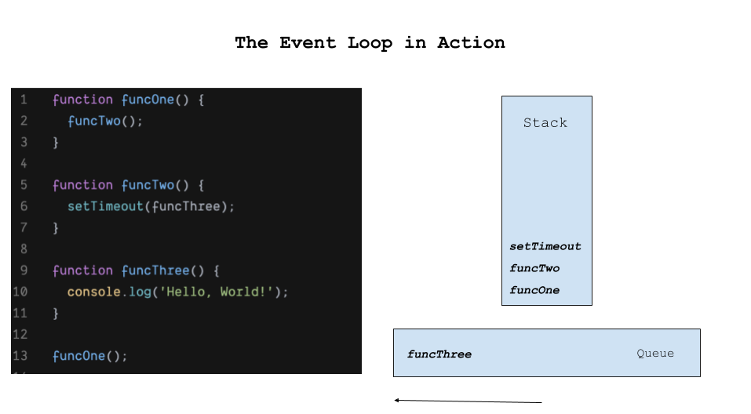

## Concurrency Model and Multithreading in Javascript

### Start Server
```
npx http-server .
```

### The Event Loop

The JavaScript engine runs an infinite loop, called the event loop, looking for tasks to run.

```javascript
const queue = {
  waitForMessage: () => {
  },
  processNextMessage: () => {
  },
};

while (queue.waitForMessage()) {
  queue.processNextMessage()
}
```

The following code:

```javascript
function funcOne() {
  funcTwo();
}

function funcTwo() {
  setTimeout(funcThree);
}

function funcThree() {
  console.log('Hello, World!');
}

funcOne();
```

Will result in this state:




#### Micro and Macro tasks

What will be the result of this code?

```javascript
setTimeout(() => console.log('Message 1: setTimeout'));

Promise.resolve('Message 2: Promise').then(console.log);

console.log('Message 3: Sync code');

```

setTimeout and the promise callbacks are added to two different queues.

The promise callback is added to the micro task queue, which takes precedent over regular tasks.

the result will look like this:

```
Message 3: Sync code
Message 2: Promise
Message 1: setTimeout
```


